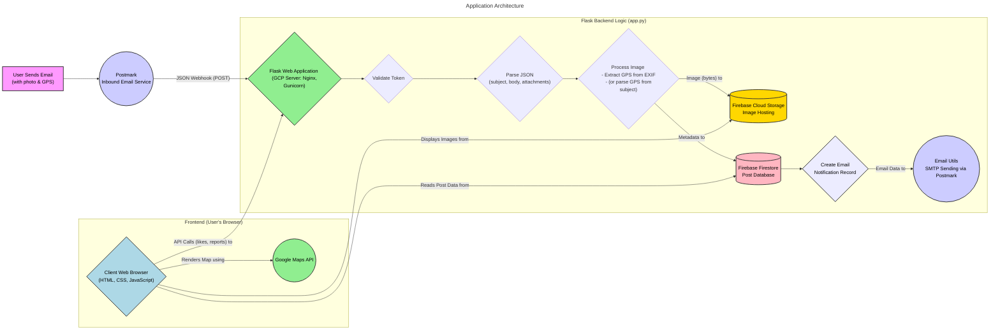

# MailMap

MailMap is a web application that allows users to submit content (text and images) via email or through the web interface. The content is displayed on an interactive map based on the location coordinates attached to the content.

## Features

- Content submission via email with image attachments
- Automatic extraction of GPS coordinates from image EXIF data
- Interactive map display of all published content
- Voting system (like/dislike) for content
- Content reporting system for inappropriate content
- Moderation system for reported content
- Administrative panel for content moderation
- Anonymous authentication for users

## Technology Stack

- **Backend**: Flask (Python)
- **Database**: Firestore (Firebase)
- **Storage**: Firebase Storage
- **Authentication**: Firebase Authentication
- **Maps**: Google Maps API (with Beta Advanced Markers)
- **Email Processing**: Postmark webhook

## Configuration

The application requires the following environment variables:

- `INBOUND_URL_TOKEN` - Secret token for Postmark webhook
- `FIREBASE_STORAGE_BUCKET` - Firebase Storage bucket name
- `GOOGLE_APPLICATION_CREDENTIALS` - Path to Firebase service account key (in production)
- `FLASK_SECRET_KEY` - Secret key for Flask sessions (required for admin panel)

## Architecture

The diagram below illustrates the main components and data flow of the application:




## Local Development

1. Clone the repository
2. Install dependencies: `pip install -r requirements.txt`
3. Set up environment variables
4. Run the application: `python app.py`

## Deployment

The application is designed to be deployed to Google Cloud Run or similar serverless platforms.

## API Endpoints

- `/webhook/postmark` - Webhook for Postmark email processing
- `/api/content/<content_id>/vote` - API for voting on content
- `/api/content/<content_id>/report` - API for reporting content
- `/api/content/create` - API for creating new content

### Admin Endpoints

- `/admin/login` - Admin login page
- `/admin/dashboard` - Admin dashboard
- `/admin/api/content/<content_id>/approve` - API for approving content
- `/admin/api/content/<content_id>/reject` - API for rejecting content

## License

This project is licensed under the MIT License - see the LICENSE file for details.
MailMap is a web application that allows users to submit content with geographical coordinates via email. The submitted content is displayed on an interactive map.

## Features

- Email submission with image attachments
- Automatic extraction of GPS coordinates from image EXIF data
- Manual coordinate specification in email subject
- Interactive map display of all published content
- Google Cloud integration (Firebase, Cloud Run, Cloud Storage)

## Development Setup

### Prerequisites

- Python 3.10+
- Google Cloud account with Firebase project
- Firebase service account key

### Installation

1. Clone the repository
2. Create and activate a virtual environment:
   ```
   python -m venv .venv
   source .venv/bin/activate  # On Windows: .venv\Scripts\activate
   ```
3. Install dependencies:
   ```
   pip install -r requirements.txt
   ```
4. Set up environment variables:
   ```
   cp .env.example .env
   # Edit .env with your configuration
   ```

### Running Locally

```
python app.py
```

The application will be available at http://localhost:8080

## Deployment

The application is configured for deployment to Google Cloud Run using GitHub Actions.

### Required GitHub Secrets

- `GCP_SA_KEY`: Google Cloud service account key with permissions for Cloud Run, Cloud Build, and Firebase
- `GCP_PROJECT_ID`: Your Google Cloud project ID
- `INBOUND_URL_TOKEN`: Secret token for email webhook authentication
- `FIREBASE_STORAGE_BUCKET`: Firebase storage bucket name

### Manual Deployment

```
gcloud builds submit --tag gcr.io/PROJECT_ID/mailmap-app
gcloud run deploy mailmap --image gcr.io/PROJECT_ID/mailmap-app --platform managed --region us-central1 --allow-unauthenticated
```

## License

MIT
